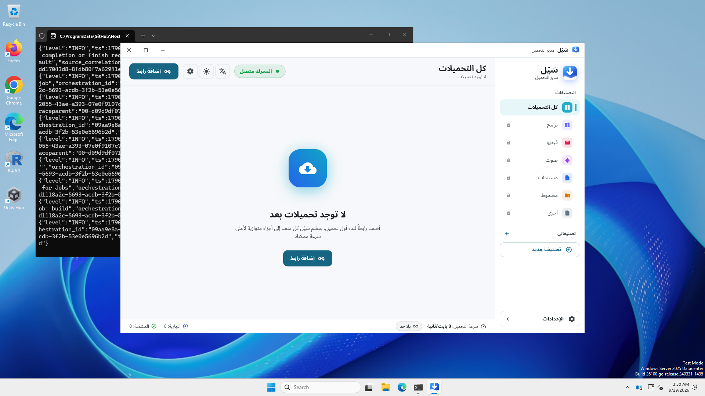
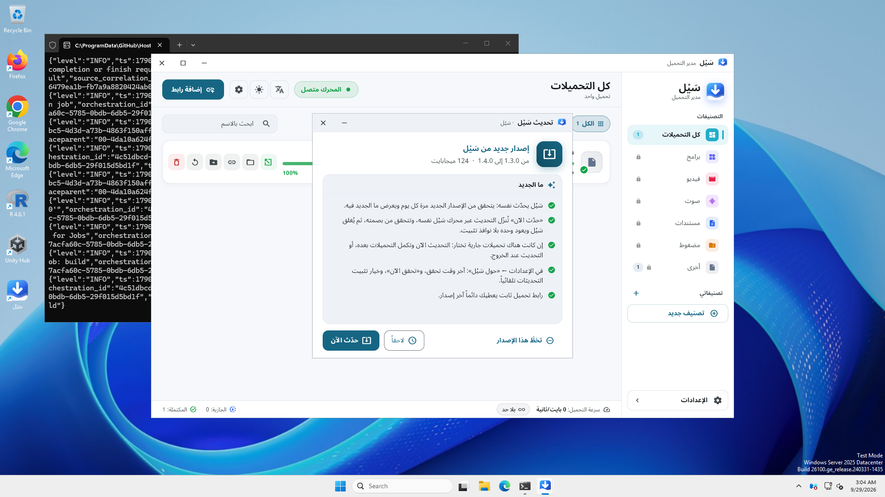
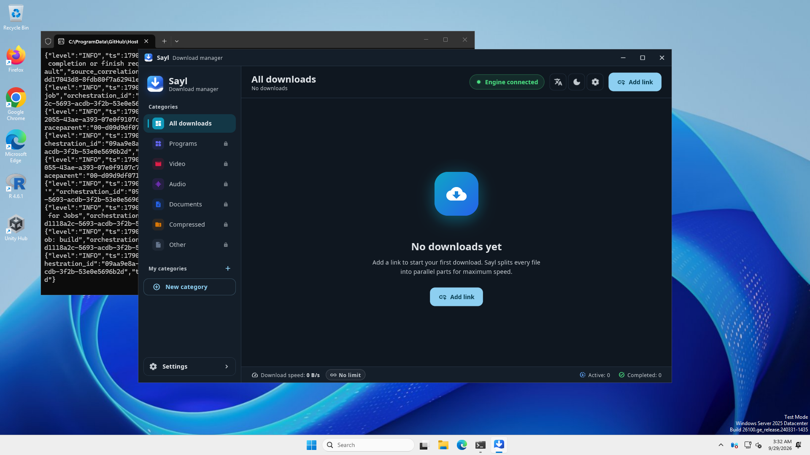
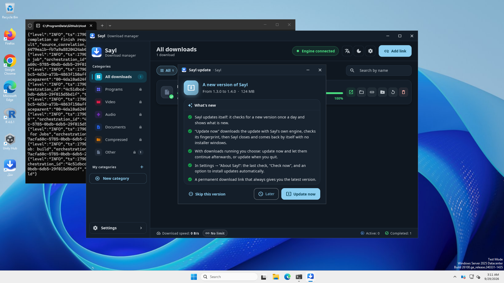

<div dir="rtl" align="right">

# سَيْل

**مدير تحميل سريع لويندوز، بالعربية أولاً.** يقسّم الملف على عدة اتصالات، ويكمل التحميل بعد انقطاع الإنترنت أو إغلاق الجهاز، ويلتقط روابط المتصفح والفيديو.

<p align="center">
  <a href="https://github.com/yasser2012/sayl-releases/releases/latest/download/Sayl-Setup.exe"><b>⬇️ تحميل سَيْل لويندوز</b></a>
</p>

رابط التحميل هذا ثابت، ويعطيك دائماً آخر إصدار. أرسله لمن تريد مرة واحدة:

```
https://github.com/yasser2012/sayl-releases/releases/latest/download/Sayl-Setup.exe
```

<p align="center"></p>

## التثبيت

1. حمّل الملف من الرابط أعلاه وافتحه.
2. اختر اللغة، ثم اضغط «التالي» و«تثبيت».
3. يعمل سَيْل على ويندوز 10 و11 (64 بت)، ولا يحتاج صلاحيات المدير.

### إن ظهرت نافذة زرقاء من ويندوز تقول إنها حمت جهازك

هذه نافذة الحماية في ويندوز. تظهر لأن سَيْل برنامج جديد غير موقّع بشهادة تجارية مدفوعة، لا لأن فيه خطراً. لتكمل:

1. اضغط **«المزيد من المعلومات»**.
2. ثم اضغط **«التشغيل على أي حال»**.

حمّل سَيْل من هذه الصفحة فقط، ولا تشغّل نسخة وصلتك من مكان آخر.

## التحديث

- سَيْل يحدّث نفسه. يتحقق من الإصدار الجديد مرة كل يوم، ويعرض لك ما الجديد فيه.
- اضغط «حدّث الآن»: يُنزَّل التحديث ويُتحقق من بصمته، ثم يُغلق سَيْل ويعود وحده. التحميلات تكمل من حيث توقفت، والإعدادات كما هي.
- في الإعدادات ← «حول سَيْل» ترى آخر وقت تحقق، وزر «تحقق الآن»، وخيار «ثبّت التحديثات تلقائياً بدون سؤال».
- ويمكنك أيضاً تثبيت الإصدار الجديد يدوياً فوق القديم وسَيْل مفتوح.

<p align="center"></p>

## إضافة المتصفح (كروم وإيدج)

تجعل الإضافة سَيْل يلتقط تحميلات المتصفح والفيديو. من داخل سَيْل افتح الإعدادات ← «المتصفح» واتبع الدليل. ستجد مجلد الإضافة بعد التثبيت هنا:

```
%LOCALAPPDATA%\Programs\Sayl\browser_extension
```

## الإصدارات السابقة

كل الإصدارات في صفحة [الإصدارات](https://github.com/yasser2012/sayl-releases/releases).

</div>

---

# Sayl

**A fast download manager for Windows, Arabic first.** It splits a file over several connections, resumes after the internet drops or the computer shuts down, and catches links and videos from the browser.

<p align="center">
  <a href="https://github.com/yasser2012/sayl-releases/releases/latest/download/Sayl-Setup.exe"><b>⬇️ Download Sayl for Windows</b></a>
</p>

This download link never changes and always gives the latest version. Send it once:

```
https://github.com/yasser2012/sayl-releases/releases/latest/download/Sayl-Setup.exe
```

<p align="center"></p>

## Installing

1. Download the file from the link above and open it.
2. Choose the language, then press "Next" and "Install".
3. Sayl runs on Windows 10 and 11 (64-bit) and needs no administrator rights.

### If a blue Windows window says it protected your PC

This is Windows SmartScreen. It shows because Sayl is a new program without a paid commercial signing certificate, not because it is harmful. To go on:

1. Click **"More info"**.
2. Then click **"Run anyway"**.

Download Sayl from this page only, and do not run a copy that reached you from elsewhere.

## Updating

- Sayl updates itself. It checks for a new version once a day and shows what is new.
- Press "Update now": the update downloads and its fingerprint is checked, then Sayl closes and comes back by itself. Downloads continue where they stopped, and your settings stay.
- In Settings → "About Sayl" you find the last check, a "Check now" button and "Install updates automatically without asking".
- You can also install a new version by hand over the old one while Sayl is open.

<p align="center"></p>

## Browser extension (Chrome and Edge)

The extension lets Sayl catch the browser's downloads and videos. In Sayl open Settings → "Browser" and follow the guide. After installing, the extension's folder is here:

```
%LOCALAPPDATA%\Programs\Sayl\browser_extension
```

## Earlier versions

Every version is on the [Releases](https://github.com/yasser2012/sayl-releases/releases) page.
